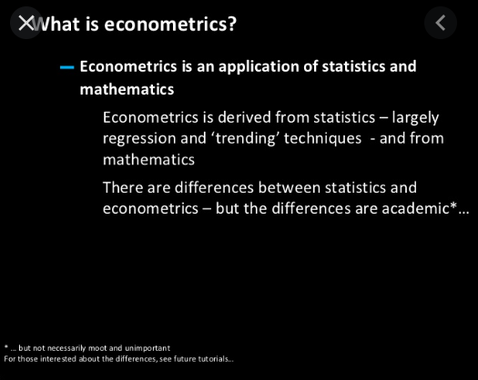

# Livros de Econometria

Biblioteca de livros de econometria.

Alguns autores

- Gujarati
- Greene
- Baum
- Sheppard
- Barreto, Howland
- Agung
- [Franses,P.](https://github.com/rhozon/Enjoyable-Econometrics/blob/master/Enjoyable%20Econometrics%20by%20Philip%20Hans%20Franses%20(z-lib.org).pdf)
- Brian Caffo, Roger Peng
- Cryer & Chan
- Croissant & Milo
- Tsay
